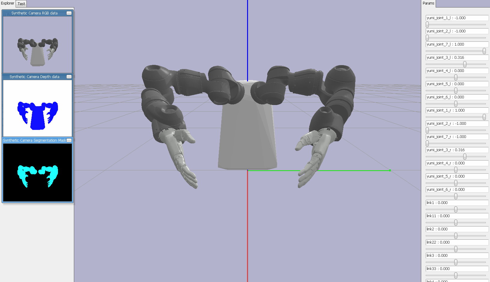

# yumi-gym
gym env for collaborative robot yumi with pybullet



**features**

- collision detection for links
- custom reward function
- sliders to tune joint angles
- synthetic camera rendering

## Installation

```bash
$ git clone git@github.com:0aqz0/yumi-gym.git
$ cd yumi-gym
$ pip install -e .
```

## Usage

```python
import gym, yumi_gym

env = gym.make('yumi-v0')
env.render()
observation = env.reset()

while True:
    env.render()
    
    action = env.action_space.sample()
    
    observation, reward, done, info = env.step(action)
```
## References

- [PyBullet Quickstart Guide](https://docs.google.com/document/d/10sXEhzFRSnvFcl3XxNGhnD4N2SedqwdAvK3dsihxVUA/edit#heading=h.p3s2oveabizm)

- [sl-rl-motion-retargeting](https://github.com/lwj2018/sl-rl-motion-retargeting)

